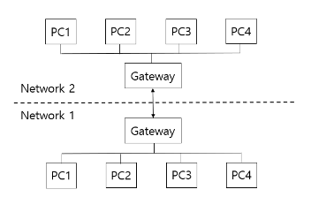

# 프록시

HTTP 프록시는 클라이언트와 서버 사이에 위치하는 중간 서버로, 클라이언트의 요청을 대신 받아 서버에 전달하고, 서버의 응답을 다시 클라이언트에게 전달하는 역할을 합니다. 주요 특징과 기능은 다음과 같습니다:

### 중개자 역할

- 프록시 서버는 클라이언트의 요청을 받아 서버에 전달하고, 서버의 응답을 다시 클라이언트에게 전달합니다.
- 이 과정에서 프록시는 요청과 응답을 수정하거나 추가 작업을 수행할 수 있습니다.
- 클라이언트는 프록시를 통해 간접적으로 서버와 통신하므로, 직접적인 연결이 필요하지 않습니다.

### 캐싱

- 프록시 서버는 자주 요청되는 리소스를 캐시에 저장할 수 있습니다.
- 동일한 요청이 다시 들어오면 원본 서버에 접근하지 않고 캐시된 응답을 반환합니다.
- 이를 통해 네트워크 트래픽을 줄이고 응답 시간을 단축시킬 수 있습니다.
- 캐시 제어 헤더(Cache-Control, Expires 등)를 사용하여 캐싱 동작을 세밀하게 제어할 수 있습니다.

### 보안

- 프록시는 클라이언트와 서버 사이의 통신을 필터링하고 모니터링할 수 있습니다.
- 악성 요청을 차단하거나 의심스러운 트래픽을 탐지할 수 있습니다.
- 클라이언트의 IP 주소를 숨기고 서버에 프록시의 IP를 노출시켜 클라이언트의 익명성을 보장할 수 있습니다.
- SSL/TLS 암호화를 통해 데이터의 기밀성을 유지할 수 있습니다.

### 성능 향상

- 프록시는 응답 데이터를 압축하거나 이미지를 최적화하여 전송 속도를 높일 수 있습니다.
- 모바일 디바이스에 최적화된 콘텐츠를 제공하는 등 클라이언트에 따라 콘텐츠를 조정할 수 있습니다.

### 로드 밸런싱

- 프록시는 여러 서버로 요청을 분산시켜 부하를 균등하게 분배할 수 있습니다.
- 이를 통해 서버의 과부하를 방지하고 전체 시스템의 성능과 가용성을 향상시킬 수 있습니다.
- 라운드 로빈, 최소 연결 수, IP 해시 등 다양한 로드 밸런싱 알고리즘을 적용할 수 있습니다.

### 콘텐츠 필터링

- 프록시는 특정 웹사이트나 콘텐츠에 대한 접근을 제한할 수 있습니다.
- 회사나 학교에서 부적절한 콘텐츠를 차단하는 데 사용될 수 있습니다.
- 사용자 인증을 요구하여 인증된 사용자만 특정 리소스에 접근할 수 있도록 제어할 수 있습니다.

### 로깅과 모니터링

- 프록시는 모든 HTTP 트래픽을 로깅하고 분석할 수 있습니다.
- 이를 통해 네트워크 사용량, 성능 병목 현상, 보안 위협 등을 모니터링하고 분석할 수 있습니다.

### 프로토콜 변환

- 프록시는 HTTP/1.1과 HTTP/2 또는 HTTPS와 HTTP 간의 프로토콜 변환을 수행할 수 있습니다.
- 이를 통해 레거시 시스템과 최신 시스템 간의 호환성을 보장할 수 있습니다.

### 지리적 분산

- 프록시를 사용하면 지리적으로 제한된 콘텐츠에 접근할 수 있습니다.
- 다른 국가의 프록시 서버를 통해 요청을 보내면 해당 국가에서 접근 가능한 콘텐츠를 볼 수 있습니다.

# 게이트웨이

게이트웨이란 문자 그대로의 뜻인 '관문', '출입구'의 역할을 한다. 게이트웨이는 다른 네트워크로 나가는 출구이며, 다른 네트워크로 들어가는 입구의 역할을 하는 꼭 필요한 통신기기의 일부분이며, 반드시 통과해야만 하는 출입문이다.

### 게이트웨이가 필요한 이유

사실 동일한 네트워크 내에 소수의 컴퓨터가 통신할땐 게이트웨이가 필요하지 않다.
문제는 '서로 다른' 네트워크의 다수의 컴퓨터가 통신할 때 직접 통신 방식을 사용하게 되면 서로 간의 통신이 매우 복잡해지고 비효율적이게 된다.

이때 게이트웨이를 사용하게 되는데,

위와 같이 게이트웨이를 두게 된다면, 어떤 컴퓨터든 서로가 가지고 있는 게이트웨이를 통해 출입해야 하기 때문에, 복잡했던 통신이 단순화되고 관리하기 쉬워지기 때문이다.

# RFC
RFC(Request for Comments)란 "비평을 기다리는 문서" 라는 의미로 컴퓨터 네트워크 공학 등에서 인터넷 기술에 적용 가능한 새로운 연구, 혁신, 기법 등을 아우르는 메모를 나타낸다.

RFC는 IETF, IRTF, IAB 와 같은 다양한 기관뿐만 아니라 개인 저자도 작성할 수 있다.

모든 RFC 문서가 표준은 아니지만, 

인터넷국제표준화기구(IETF)는 일부 RFC를 인터넷 표준으로 받아들이기도 한다.

